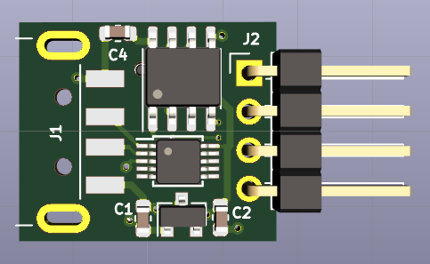
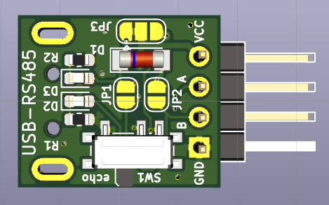
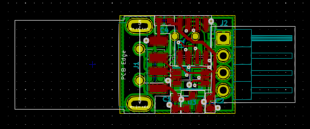
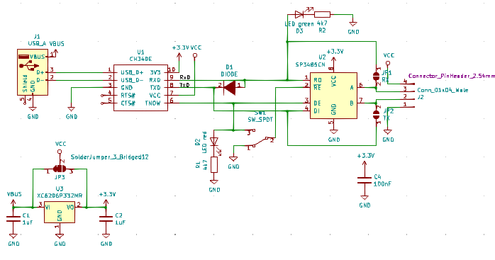

# RS485-CH340E

I needed a USB-RS485 dongle with reliable automatic direction control but it was impossible to find anything that's both reliable and cheap (not to speak of small). The "budget" cmmercial USB-RS485 dongles "try" to implement direction controll with the host's Tx signal. The timing of such a solution is tricky (and potentially unreliable). A "popular" work-around is using a [questionable "dominant-recessive"](https://hackaday.io/project/167532-modbus-things-with-stm8-eforth/log/168474-finding-the-culprit) approach to RX-TX switching with a "CAN network style" recessive default state. Such a hack is certainly not RS485 compliant and may randomly fail if multiple nodes are connected, the bus cable is long, at higher bit-rates, if the weather changes, or in any combination of that.

Fortunately, the very cheap CH340E provides a true RX/TX direction signal that can be used for controlling an RS485 transceiver with perfect timing. I was surprised that there are still no cheap CH340E based RS485 dongles on the market - so I decided to make one. This repository provides a small CH340E based configurable RS485 or TTL 2/3-wire USB dongle.

If you're "shopping" for ideas how to use this solution down for a mass-market product: it's certainly possible to make solution with a minimal BOM, or one with additional robustness. Feel free to writen me an [issue](https://github.com/TG9541/rs485-ch340e/issues) if you want to learn how.

## PCB

## Schematic

The BOM is in the doc folder.

Note: the supply voltage of U1 can be selected with J3. It is either 5V (default) or 3.3V (1-2 open, 2-3 closed). This configuration option has not been tested.

## RS485 configuration:

The built-in CH340E 3.3V LDO can provide a 3.3V supply for the RS485 transceiver which makes populating the linear voltage regulator U3 (XC6206P332MR) optional. For most applications it's better to populate U3 since the maximum number of RS485 nodes that can be connected to the bus might be limited by the current that the internal LDO can provide.

Note: SW1 controlls "TX-RX echo" (pin1-1 closed) or "no echo" (pin2-3 closed, this is standard RS485 functionality). If switching isn't required the pads can be bridged with a bit of solder. Most people won't need switching and in a re-design I would certainly replace SW1 with a jumper.

### Core RS485 configuration (limited fan-out): 
Populate the following:
* front side: U1, U2, C2, C4, J2
* back side: SW1

## Standar RS485 configuration (standard fan-out):
Populate the following:
* front side: U1, U2, U3, C1, C2, C4, J2
* back side: SW1, R1, R2, D2, D3

## RS232-TTL configuration:

The dongle can be configured for 3-wire (full duplex) or 2-wire (half duplex) communication. The 2-wire option can be used for command-response console protocols, e.g., the [half-duplex STM8 eForth configuration](https://github.com/TG9541/stm8ef/wiki/STM8-eForth-Programming-Tools#using-a-serial-interface-for-2-wire-communication).

### 3-wire configuration: 
Populate the following:
* front side: U1, C2, C4, J2
* back side: (optional) R1, R2, D2, D3 

Close jumpers J1 (RX, J2.3) and J2 (TX, J2.2) on the back side. 

### 2-wire configuration: 
Populate the following:
* front side: U1, C2, C4, J2
* back side: D1, (optional) R1, R2, D2, D3 

Close jumpers J1 (RX/TX, J2.3) on the back side.
